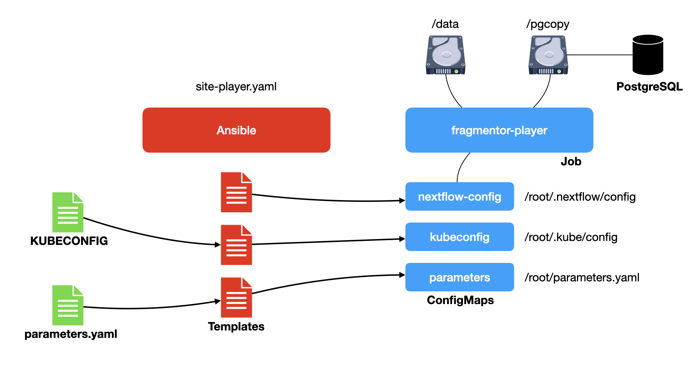

# fragmentor-k8s-orchestration


Ansible playbooks for the Kubernetes-based execution of [fragmentor]
**Playbooks** (formally the `fragmentor-ansible` repository).

---



This repository's `site-player` play launches a Kubernetes **Pod** (based on the [fragmentor]
repository's _player_ image). It uses **ConfigMaps** to _inject_ a Nextflow configuration
file, a copy of your chosen `KUBECONFIG` file, and a copy of the play's `parameters.yaml`.
The _player_ **Pod** is also attached to a **PersistentVolumeClaim** for data
processing and the `/pgcopy` volume that is shared with your configured database.

The `fragmentor-player` image (built from the [fragmentor] repository) contains all the
playbooks and code from the [fragmentor] repository so that it can orchestrate any play
authored in that repository: `standardise`, `fragment`, `inchi`, `extract`, and `combine`.

## Prerequisites
Before you attempt to execute any fragmentation plays...

1.  You will need a Kubernetes cluster with a ReadWriteMany storage class
    (i.e. NFS or, if using AWS, EFS)
2.  You will need a Kubernetes namespace that contains a pre-deployed postgres
    server, by default the namespace is expected to be called `fragmentor`.
    You can use the Ansible playbook and role in our [postgresql-ansible]
    GitHub repository to create the namespace and install a PostgreSQL
    database (See the **Kubernetes namespace setup** section below).
3.  The database needs to be using a shareable (EFS/NFS) volume
    (`ReadWriteMany`) for use with **pgcopy** command data - and you'll need
    the name of the PVC. This is expected to be mounted into the database at
    `/pgcopy`.
4.  You will need at least 10 spare cores available and 8Gi of RAM in the
    cluster to satisfy the needs of the database and player Pods.
5.  The database server needs a user (`fragmentor`) with SUPERUSER privilege
    and a database (`fairmolecules`)
6.  The database service is expected to be exposed by a **Service**
    called `postgres`
7.  Your cluster must contain nodes with the label
    `informaticsmatters.com/purpose=core` as the database Pod will require
    a node with this label during scheduling
8.  Your cluster must contain nodes with the label
    `informaticsmatters.com/purpose-fragmentor=yes`. The fragmentor player and Nextflow
    containers will only run on nodes that contain this label.
9.  Each fragmentor node must have at least 4 cores and 8Gi RAM.
10. You will need an AWS/S3 bucket that holds your vendor molecule data.
    This bucket will also be used for the delivery of the extracted
    fragmentation/graph data.
11. You will need a Kubernetes cluster whose version matches the fragmentor `player` image.
    At the time of writing this was Kubernetes 1.31 but check the
    fragmentor's `Dockerfile-player` where the kubectl that's installed
    is defined in the build-time argument `KUBECTL_VERSION`.
12. You will need your Kubernetes config file.
13. You will need AWS credentials (that allow for bucket access).
14. You will need to be able to run `kubectl` from the command-line
    as the player expects to use it to obtain the cluster host and its IP.
    So ensure that `KUBECONFIG` is set appropriately.

## Namespace database setup
You can conveniently create the required namespace and database using our
[postgresql-ansible] Ansible playbooks.

>   You will need to decide now how much disk space you need to
    give your database. There are volumes for the main database
    and ReadWriteMany volume for 'pgcopy' actions.

Start from the project root of a clone of the repository: -

    python -m venv venv

    source venv/bin/activate
    pip install --upgrade pip
    pip install -r requirements.txt

...and create the database and corresponding namespace using an Ansible
YAML-based parameter file. Here's an example that should work for 'small'
fragmentation exercises (a few thousand molecules) on a typical AWS
cluster: -

```yaml
---
pg_namespace: fragmentor
pg_aux_user: fragmentor
pg_aux_user_password: bullfinch
pg_aux_database: fairmolecules
pg_copy_vol_size_g: 5
pg_copy_vol_storageclass: efs
pg_vol_size_g: 5
pg_vol_storageclass: gp2
pg_cpu_request: 4
pg_cpu_limit: 8
pg_mem_request: 2Gi
pg_mem_limit: 4Gi
```

>   Your fragmentation stages may require additional postgres configuration
    in order to function properly (which typically relates to working memory
    and cores/processes). If this is so then you can provide an 'additional'
    postgres configuration file and name this using the
    playbook's `pg_extra_configuration_file` variable.

You will need to set a few Kubernetes variables...

    export K8S_AUTH_HOST=https://example.com
    export K8S_AUTH_API_KEY=1234
    export K8S_AUTH_VERIFY_SSL=no

Then run the playbook...

    ansible-playbook site.yaml -e @parameters.yaml
    [...]

## The kubeconfig ConfigMap
The player is configured to map the cluster's `KUBECONFIG` file into the nextflow
Pods created by the various playbooks. To do this you must create a **ConfigMap** in
the `fragmentor` namespace created in the step above.

This is done using `Kustomize` and the convenient bash script that copies your
chosen `KUBECONFIG` file into the project's `kustomization` directory
prior to running the kustomize command.

Set your KUBECONFIG environment variable and then run the command: -

    export KUBECONFIG=~/k8s-config/config-fragmentor
    ./deploy-kubeconfig.sh

You are shown the resulting **ConfigMap** YAML before being asked to continue.

>   If you encounter a warning about missing the
    kubectl.kubernetes.io/last-applied-configuration you most likely had a **ConfigMap**
    deployed already and you can probably safely ignore this, but check the content
    of the corresponding **Namespace** object, just to be safe.
    The warning is issued because it's probably the first copy of the resource
    and there is no annotation kustomize can use to figure out what to patch and change
    with the exiting object.

## Using a custom work volume
If you need to setup a custom PVC (which has to be **ReadWriteMany**) you can set one
up, and if it's called `work` the playbooks will use it rather than deploy their own.
Here's an example PV and PVC for a custom NFS work volume: -

```yaml
---
kind: PersistentVolume
apiVersion: v1
metadata:
  name: fragmentor-work
spec:
  capacity:
    storage: 4Ti
  volumeMode: Filesystem
  claimRef:
    name: work
    namespace: fragmentor
  accessModes:
  - ReadWriteMany
  persistentVolumeReclaimPolicy: Retain
  nfs:
    path: /nfs/kubernetes-fragmentor/work
    server: 130.246.213.182
```

```yaml
---
kind: PersistentVolumeClaim
apiVersion: v1
metadata:
  name: work
  namespace: fragmentor
spec:
  storageClassName: ""
  volumeName: fragmentor-work
  accessModes:
  - ReadWriteMany
  resources:
    requests:
      storage: 4Ti
```

## Running a fragmentor play
the _player_ Pod (implemented in and released from the [fragmentor] repository)
provides a series of Ansible playbooks for each stage of fragmentation: -

-   **standardise**
-   **fragment**
-   **inchi**
-   **extract**
-   **combine**

All of these playbooks are available in the _player_ container in Kubernetes,
launched by this repo's playbook. What this repository's playbook does is
launch the _player_ container (in a pre-existing Kubernetes **Namespace**)
as a **Job**, mapping Ansible playbook parameters into the container prior
to its execution. It sets an environment in the _player_ that is used to
select the play that is run.

To run a play you must set a set of play-specific parameters in the local file
`parameters.yaml`. Once you've defined these you can run the _player_.

Start from a virtual environment: -

    python -m venv venv

    source venv/bin/activate
    pip install --upgrade pip
    pip install -r requirements.txt

As always, set a few key environment parameters: -

    export K8S_AUTH_HOST=https://example.com
    export K8S_AUTH_API_KEY=?????
    export K8S_AUTH_VERIFY_SSL=no

    export KUBECONFIG=~/.kube/config

For access to AWS S3 you will need to provide the following, with the
`AWS_ENDPOINT_URL` required for non-AWS buckets: -

    export AWS_ACCESS_KEY_ID=?????
    export AWS_SECRET_ACCESS_KEY=?????
    export AWS_DEFAULT_REGION=????
    export AWS_ENDPOINT_URL=????

You _name_ the play to run using our playbook's `fp_play` variable.
In this example we're running the *database reset* play and setting
the storage class to `nfs`: -

    ansible-playbook site-player.yaml \
        -e fp_play=db-server-configure_create-database \
        -e fp_work_volume_storageclass=nfs

After displaying the contents of the parameter file, the `KUBECONFIG` file and the
player container image details each play will ask you to confirm that you want to run
the play before anything destructive happens.

As individual plays can take a considerable time to run the `site-player`
playbook does not wait for the result - you need to
inspect the _player_ Pod yourself to check on the its progress.

>   The player playbooks here will prevent you from running another _play_ while
    one is running.

## Playbook tags (experimental)
Some playbooks introduce `tags`. For example the **fragment** playbook
uses the `fragmentation` tag to cover the tasks that actually perform the
fragmentation, and `load_edges` and `load_nodes` for the logic that loads that data
into the database. This is used to allow you to skip certain playbook logic
should you need to re-run a play.

You can *skip* tagged logic using the `fp_play_skip_tags` variable.
So, to skip fragmentation logic you could add the following to your parameter file: -

```yaml
fp_play_skip_tags: fragmentation
```

The supplied tags are a comma-separated list of tags (without spaces), so this
will skip loading nodes and edges: -

```yaml
fp_play_skip_tags: load_nodes,load_edges
```

You can display the tags supported by a playbook by adding the `--list-tags` option
to the `fp_play_extra_args` variable in your parameter file: -

```yaml
fp_play_extra_args: --list-tags
```

Doing this will run the playbook to display the tags. The playbook will not run
id you add this argument so you can use it to safely check a play's tags.

## Exposed parameter file content
Please be aware that when you rub a playbook the parameter file you provide to control
the play (fragment, extract, etc.) will be exposed in the Ansible output log here and
injected into the _player_ container using a Kubernetes `ConfigMap`.
Consequently, any 'sensitive' information that you put in a parameter file
will be visible in the local log and to anyone who has access the the Kubernetes
**fragmentor** `Namespace` used to run the plays.

## Cheat-sheet
With a `parameter.yaml` file like the following in your project directory
(which expects to find xchem/dsip data in your bucket) you should be able to
run a sequence of plays.

>   The parameter filename is assumed - if you use a different
    filename you will need to add `-e fp_parameter_file=myfile.yaml` to the
    playbook examples below.

>   You will need to provide the name of the AWS S3 bucket that you're
    using to store RAW vendor data and extracted results. Here we're using the
    bucket `im-fragnet` but (as these names are global you wil need to replace
    it with the name of your bucket.

```yaml
---
database_login_host: postgres
deployment: production
bucket: im-fragnet
runpath: /work
add_backup: no
vendor: xchem_dsip
version: v1
extracts:
- lib:
    vendor: xchem_dsip
    version: v1
    regenerate_index: yes
hardware:
  production:
    parallel_jobs: 360
```

-   **Reset fragmentation database**

>   This must be done once, and only once, prior to running any fragmentation
    plays. It formats the database by adding key tables and seeds then
    with key records.

```
    ansible-playbook site-player.yaml \
        -e fp_play=db-server-configure_create-database
```

-   **Standardise**

```
    ansible-playbook site-player.yaml -e fp_play=standardise
```

-   **Fragment**

```
    ansible-playbook site-player.yaml -e fp_play=fragment
```

-   **InChi**

```
    ansible-playbook site-player.yaml -e fp_play=inchi
```

-   **Extract** (a dataset to graph CSV files)

```
    ansible-playbook site-player.yaml -e fp_play=extract
```

-   **Combine** (multiple datasets into graph CSV files)

Using a slightly modified parameter file (shown below) you can then combine
fragmented datasets.

```yaml
---
database_login_host: postgres
deployment: production
bucket: im-fragnet
runpath: /work
add_backup: no
vendor: xchem_dsip
version: v1
combine:
- lib:
    path: extract/xchem_dsip/v1
    data_source: s3
    s3_bucket: im-fragnet
    s3_access_key: ?????
    s3_secret_key: ?????
    s3_region: ????
    s3_url: ????
- lib:
    path: extract/xchem_spot/v1
    data_source: s3
    s3_bucket: im-fragnet
    s3_access_key: ?????
    s3_secret_key: ?????
    s3_region: ????
    s3_url: ????
output_destination: s3
path_out: xchem_combi_alan_20201117
s3_out_access_key: ?????
s3_out_secret_key: ?????
s3_out_region: ?????
s3_out_url: ?????
hardware:
  production:
    parallel_jobs: 360
```

```
    ansible-playbook site-player.yaml -e fp_play=combine
```

## A convenient player query playbook
If you don't have visual access to the cluster you can run
the following playbook, which summarises the phase of the currently executing
play. It will tell you if the current play is still running.

    ansible-playbook site-player_query.yaml

It finishes with a summary message like this when a play is still running: -

```
TASK [player : Display query message] *****************************************
Wednesday 18 November 2020  13:17:54 +0000 (0:00:00.049)       0:00:07.401 ****
ok: [localhost] => {
    "msg": "The 'standardise' play is running"
}
```

...and something like this when a play has finished successfully: -

```
TASK [player : Display query message] ************************************************************************************
ok: [localhost] => {
    "msg": "The 'db-server-configure_create-database' play has finished (SUCCESSFULLY)"
}
```

## Killing the player (not recommended)
If the player is failing, and you want to kill it, and the Job that
launched it, you can run the kill-player playbook: -

    ansible-playbook site-player_kill-player.yaml

---

[fragmentor]: https://github.com/InformaticsMatters/fragmentor
[postgresql-ansible]: https://github.com/InformaticsMatters/postgresql-ansible
